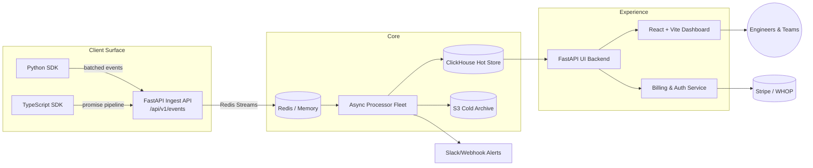

## WatchLLM — AI Observability Platform

<div align="center">

```text
  ███████╗███████╗███╗   ██╗████████╗██████╗ ██╗   ██╗
  ██╔════╝██╔════╝████╗  ██║╚══██╔══╝██╔══██╗██║   ██║
  ███████╗█████╗  ██╔██╗ ██║   ██║   ██████╔╝╚██╗ ██╔╝
  ╚════██║██╔══╝  ██║╚██╗██║   ██║   ██╔══██╗  ╚██╔╝ 
  ███████║███████╗██║ ╚████║   ██║   ██║  ██║  ╚██║  
  ╚══════╝╚══════╝╚═╝  ╚═══╝   ╚═╝   ╚═╝  ╚═╝   ╚═╝   

                S E N T R Y   F O R   A I

   Real-time observability for production LLMs, agents, RAG pipelines, and AI workflows.
```

[](https://fastapi.tiangolo.com/)
[](https://www.python.org/)
[](https://react.dev/)
[](https://www.typescriptlang.org/)
[](https://redis.io/)
[](https://clickhouse.com/)
[](https://vitejs.dev/)
[](https://tailwindcss.com/)
[](https://tanstack.com/query)
[](https://mermaid.js.org/)

</div>

---

### Why this stack matters
• **End-to-end path is implemented, not hypothetical:** Python and JS SDKs emit events → FastAPI ingest → Redis Streams (or in-memory fallback) → processor workers → ClickHouse → UI backend → React/Vite dashboards.  
• **Operationally disciplined:** Single `run_*` scripts boot each service; health checks and fallbacks are built in so the system can be exercised like production on a laptop.  
• **Designed for observability of observability:** Structured logs, health endpoints, and clear separation between hot analytics storage and cold archive are wired into the architecture and docs.  
• **Enterprise posture from day one:** Multi-tenant isolation, API keys, billing surface, RBAC, retention strategy, and SDK-level background workers are part of the baseline, not an afterthought.  

---

### Platform pillars
| Pillar | Implementation Notes |
| --- | --- |
| **High-throughput ingestion** | `services/ingest-api` validates payloads with Pydantic, enforces API-key auth, and queues events into Redis Streams with a deterministic in-memory fallback for offline development. |
| **Processor pipeline** | `services/processor` normalizes events, enriches model metadata, computes cost metrics, and sends data to ClickHouse and S3, emitting alerts when thresholds are breached. |
| **LLM-centric dashboard** | `web/` (React + Vite + Tailwind + TanStack Query + Recharts) exposes latency, error-rate, token, and cost views tuned for AI workloads, with authenticated routing and project scoping. |
| **SDK ecosystem** | `libs/sdk-python` and `libs/sdk-js` provide typed, non-blocking clients with background queues, retries, and a consistent event contract across languages. |
| **Billing and operations** | `services/billing` is responsible for Stripe/WHOP integration, usage metering, and plan enforcement; docs encode the deployment and operational expectations. |

---

### System topology


---

### Services
• `services/ingest-api`  » FastAPI ingest surface with Pydantic models, API key authentication, and Redis Streams / in-memory queue abstraction.  
• `services/processor`   » Asynchronous worker that enriches payloads, evaluates risk, writes to ClickHouse, and triggers alert flows.  
• `services/ui-backend`  » FastAPI query layer exposing `/events`, `/stats`, `/projects`, `/auth`, `/billing`, all scoped per project and tenant.  
• `services/billing`     » Stripe/WHOP bridge for usage tracking, entitlements, and webhook verification.  
• `web/`                 » React 18 + Vite + Tailwind dashboard with TanStack Query polling, Recharts visualizations, and guarded routes.  
• `libs/sdk-python` and `libs/sdk-js` » Typed SDKs that integrate into existing applications with minimal surface area and predictable failure modes.  

---

### SDK implementation
```118:134:libs/sdk-python/watchllm/client.py
    def capture_llm_usage(self, model: str, input_tokens: int, output_tokens: int, cost: float = 0.0):
        body = {
            "model": model,
            "inputTokens": input_tokens,
            "outputTokens": output_tokens,
            "totalTokens": input_tokens + output_tokens,
            "cost": cost
        }
        self.capture_event("token_usage", body)
```
‣ Background worker thread, a bounded in-process queue, HTTP session reuse, and an `atexit` flush ensure telemetry is delivered without blocking the caller or leaking events on shutdown.  

---

### Dashboard snapshot
```34:112:web/src/pages/DashboardPage.tsx
      <div className="grid grid-cols-1 md:grid-cols-2 lg:grid-cols-4 gap-6">
        <StatCard title="Total Requests" value={overview?.total_events.toLocaleString() || 0} />
        <StatCard title="Error Rate" value={`${overview?.error_rate_pct.toFixed(2)}%`} />
        <StatCard title="Total Cost" value={`$${overview?.total_cost_usd.toFixed(4)}`} />
        <StatCard title="Total Tokens" value={(overview?.total_tokens || 0).toLocaleString()} />
      </div>
```
‣ The dashboard is built for operators: time-range filters, automatic refresh via TanStack Query, and metrics chosen for AI systems (latency, error rate, token volume, and spend).  

---

### Command surface
| Command | Purpose |
| --- | --- |
| `python run_ingest.py` | Start the FastAPI ingest service on port 8000 with Redis or in-memory queue and OpenAPI surfaced. |
| `python run_processor.py` | Run the event consumer and processing pipeline, including ClickHouse writes and alert triggers. |
| `python run_ui_backend.py` | Start the authenticated stats/events API on port 8001. |
| `npm --prefix web run dev` | Launch the React/Vite dashboard on port 3000 with protected routes. |
| `pytest tests/integration` | Exercise the SDK → API → processor loop end-to-end. |

---

### Environments and health
• `.env.example` and Pydantic settings centralize configuration and keep credentials out of source.  
• `/api/healthz`, `/livez`, and `/metrics` endpoints are defined per service to support readiness, liveness, and monitoring integration.  
• ClickHouse and Redis mock modes provide deterministic behavior when external services are unavailable.  
• Deployment is documented to move from local processes to containerized services and eventually orchestrated environments.  

---

### Execution timeline
| Phase | Status | Detail |
| --- | --- | --- |
| **Phase 1** | Complete | SDKs, ingest API, processor, UI backend, and React dashboard implemented and wired together. |
| **Phase 2** | Complete | Debugging passes, mock data support, dependency cleanup, and authentication flow validation. |
| **Phase 3** | In progress | Containerization, production deployment, and alert integrations. |
| **Phase 4** | Planned | Hallucination detectors, agent debugger, and governance / enterprise controls. |

---

### Roadmap focus
• One-line install and consistent event model across languages.  
• Deep agent and tool-call debugging views with step-level introspection.  
• Governance layer (RBAC, SCIM, policy engine) suitable for regulated environments.  
• Autonomous monitoring components that track drift, cost, and quality and surface concrete remediation steps.  

---

### Contact
Building WatchLLM as a focused AI observability control plane. If you are operating production LLM or agent workloads and care about traceability, reliability, and cost discipline, this is the surface I am extending.  

